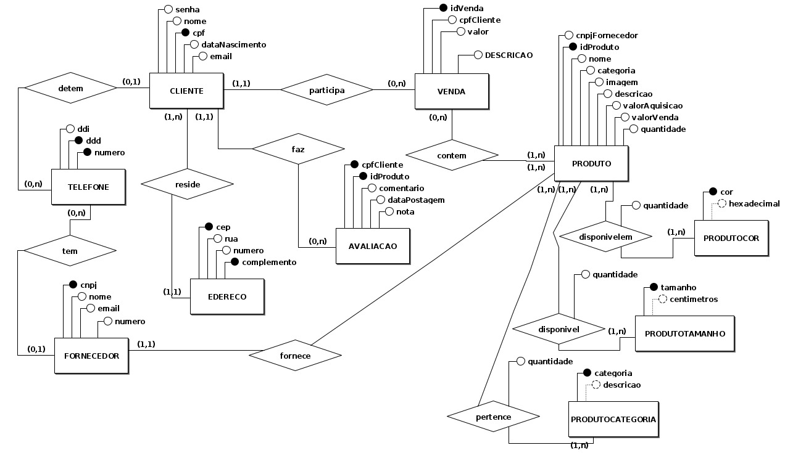

# 4.1.2 Visão de Dados
 

A visão de dados é um componente essencial na arquitetura de sistemas, responsável por descrever a estrutura, organização e fluxo dos dados dentro de uma aplicação. Ela fornece uma compreensão detalhada de como os dados são armazenados, acessados e manipulados, servindo como um guia para garantir a integridade, consistência e segurança das informações no sistema.
 

No projeto em questão, foram desenvolvidos um Modelo Entidade-Relacionamento (ME-R), que foi validado pelo Product Owner do projeto, depois disso foi feito um Diagrama Entidade-Relacionamento (DE-R) e um Diagrama Lógico de Dados (DLD). O ME-R e o DE-R representam graficamente as entidades do sistema e suas relações, enquanto o DLD detalha a estrutura lógica dos dados, mostrando como eles serão organizados e manipulados no banco de dados. Esses artefatos são fundamentais para garantir que a modelagem dos dados esteja alinhada com os requisitos do sistema, facilitando a implementação e manutenção.

## 4.1.2.1 ME-R
No projeto em questão, foi desenvolvido um Modelo Entidade-Relacionamento (ME-R) como parte da visão de dados. O ME-R foi criado com o objetivo de representar as principais entidades e seus relacionamentos no sistema, servindo como uma base fundamental para a estruturação do banco de dados.

Após a elaboração do ME-R, foi realizada uma validação por meio de uma entrevista online com o Product Owner (João Costa) do projeto. A entrevista ocorreu via Microsoft Teams e teve como propósito garantir que o modelo atendesse aos requisitos e expectativas do cliente, bem como identificar possíveis ajustes ou melhorias. Essa validação foi essencial para assegurar o alinhamento entre o modelo de dados proposto e as necessidades do projeto, contribuindo para a qualidade e a eficácia da solução desenvolvida.

Gravação da Reunião de validação do ME-R : https://www.youtube.com/watch?v=p-feHWuKib0

 

### Entidades:
- CLIENTE
- ENDERECO
- TELEFONE
- PRODUTO
- AVALIACAO
- VENDA
- FORNECEDOR
- PRODUTOCOR 
- PRODUTOTAMANHO
- PRODUTOCATEGORIA
   
 

### Atributos:
- CLIENTE (senha, nome, cpf, rg, dataNascimento, email) 
- ENDERECO(cep, rua, numero, complemento)
- TELEFONE(ddi, ddd, numero)
- PRODUTO (idProduto, nome, categoria, descricao, valorAquisicao, valorVenda, imagem,quantidade, cnpjFornecedor )
- AVALIACAO (cpfCliente, idProduto, comentario, dataPostagem, nota)
- VENDA (idVenda, cpfCliente, valor, descricao)
- FORNECEDOR(nome, cnpj, email, numero)
- PRODUTOCOR ((hexadecimal), cor,)
- PRODUTOTAMANHO ((centimetros), tamanho)
- PRODUTOCATEGORIA ((descricao), categoria)

 

### Relacionamentos:
- CLIENTE - participa - VENDA

cardinalidade 1:m
- VENDA - contém - PRODUTO

cardinalidade n:m
- CLIENTE - possui - ENDERECO

cardinalidade n:m
- CLIENTE - detém - TELEFONE
 cardinalidade 1:n
- CLIENTE - faz - AVALIACAO
 
 cardinalidade 1:n
- FORNECEDOR - tem - TELEFONE
 
 cardinalidade 1:n
- PRODUTO - fornecido - FORNECEDOR

cardinalidade n:m
- PRODUTO - tem - PRODUTOCOR

cardinalidade n:m
- PRODUTO - disponivel - PRODUTOTAMANHO

cardinalidade n:m
- PRODUTO - pertence - PRODUTOCATEGORIA

cardinalidade n:m

## 4.1.2.2 DE-R

O DE-R, desenvolvido no BRModelo com base no ME-R depois de validado pelo P.O, capturou as principais entidades e seus relacionamentos, servindo como base para a modelagem do banco de dados.

 

<h6 align = "center">Figura 1: Diagrama Entidade-Relacionamento</h6>

## 4.1.2.3 DLD

 A partir do diagrama entidade-relacionamento, foi possível gerar o DLD, que detalha a implementação lógica das entidades e suas interações no banco de dados relacional. 

<h6 align = "center">Figura 2: Diagrama Lógico de Dados </h6>
Referências

>PRESSMAN, R. S. Engenharia de Software: uma abordagem profissional. 7. ed. Porto Alegre: AMGH, 2016.
Versionamento

| Versão | Alteração |  Responsável  | Revisor | Data de realização | Data de revisão |
| :------: | :---: | :-----: | :----: | :----: | :-----: |
| 1.0    | Inicio da estrutura do documento | [Guilherme Oliveira](https://github.com/GG555-13)|[Rodrigo Wright](https://github.com/RodrigoWright) | 14/08/2024 | 14/08/2024 |
| 1.1    | Adicionando o texto ME-R, DE-R e DLD | [Guilherme Oliveira](https://github.com/GG555-13)|[Rodrigo Wright](https://github.com/RodrigoWright) | 14/08/2024 | 14/08/2024 |
| 1.2    | Participantes da entrevista e texto | [Guilherme Oliveira](https://github.com/GG555-13) [Rodrigo Wright](https://github.com/RodrigoWright) [JoãoCosta](https://github.com/jvcostta) |[Rodrigo Wright](https://github.com/RodrigoWright) | 15/08/2024 | 15/08/2024 |
| 1.3    | Elaboração e adição do DE-R e DLD | [Rodrigo Wright](https://github.com/RodrigoWright) |[Guilherme Oliveira](https://github.com/GG555-13) | 15/08/2024 | 15/08/2024 |
